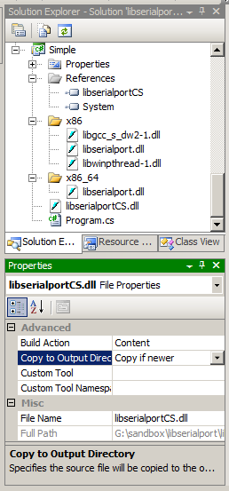

# libserialportCS
Binding for C# of libserialport (http://sigrok.org/wiki/Libserialport)

## Usage

### Simple

````
using System;
using System.Text;
using libserialport;

namespace Simple
{
  class Program
  {
    static void Main(string[] args)
    {
      using (SerialPortObj port = new SerialPortObj("COM2"))
      {
        port.open();
        port.setBaudrate(9600);
        byte[] buffer1 = Encoding.ASCII.GetBytes("Hello");
        int cnt = port.blockingWrite(buffer1, 0);
        byte[] buffer2 = new byte[50];
        cnt = port.blockingRead(buffer2, 1000);
        String s = Encoding.ASCII.GetString(buffer2, 0, cnt);
        Console.WriteLine(s);
        port.close();
      }
    }
  }
}
````

Add `libserialportCS.dll` to your project. Set "Build Action"
to `Content` and "Copy to Output Directory" to `Copy if newer`.
Also create two folders `x86` and `x86_64` to your project
and add the native DLLs to them. Also set "Build Action" 
and "Copy to Output Directory" to same values.



## Building

### Windows using MinGW64

Start MSYS2 MinGW 64 bit shell (Start >> MSYS2 64bit >> MSYS2 64bit >> MSYS2 MinGW 64-bit)

````
$ cd /sandbox/libserialport/libserialport/
$ make -f mingw64.mak clean all
$ ls -l libserialport.dll
-rwxr-xr-x 1 martin None 87552 Jul 16 10:39 libserialport.dll

$ cp libserialport.dll ../cs/libserialport/x86_64/
$
````

Start SYS2 MinGW 32 bit shell (Start >> MSYS2 64bit >> MSYS2 64bit >> MSYS2 MinGW 32-bit)

````
$ cd /sandbox/libserialport/libserialport/
$ make -f mingw64.mak clean all
$ $ ls -l libserialport.dll
-rwxr-xr-x 1 martin None 97280 Jul 16 10:43 libserialport.dll

$ cp libserialport.dll ../cs/libserialport/x86/
$ cp /mingw32/bin/libgcc_s_dw2-1.dll ../cs/libserialport/x86/
$ cp /mingw32/bin/libwinpthread-1.dll ../cs/libserialport/x86/
$ ls -l ../cs/libserialport/x86/
total 324
-rwxr-xr-x 1 martin None 157895 Jul 16 10:48 libgcc_s_dw2-1.dll
-rwxr-xr-x 1 martin None  97280 Jul 16 10:48 libserialport.dll
-rwxr-xr-x 1 martin None  71838 Jul 16 10:49 libwinpthread-1.dll

$
````

### Windows using VS2019

See http://sigrok.org/wiki/Libserialport.

### Linux

````
$ git clone git://sigrok.org/libserialport
$ cd libserialport/
$ ./autogen.sh
$ ./configure
$ make
$ sudo make install
$ cd /usr/local/lib/
$ sudo rm libserialport.so
$ sudo rm libserialport.so.0
$ sudo ln -s libserialport.so.0.1.0 libserialport.so.0
$ sudo ln -s libserialport.so.0 libserialport.so
$ sudo ldconfig
````


